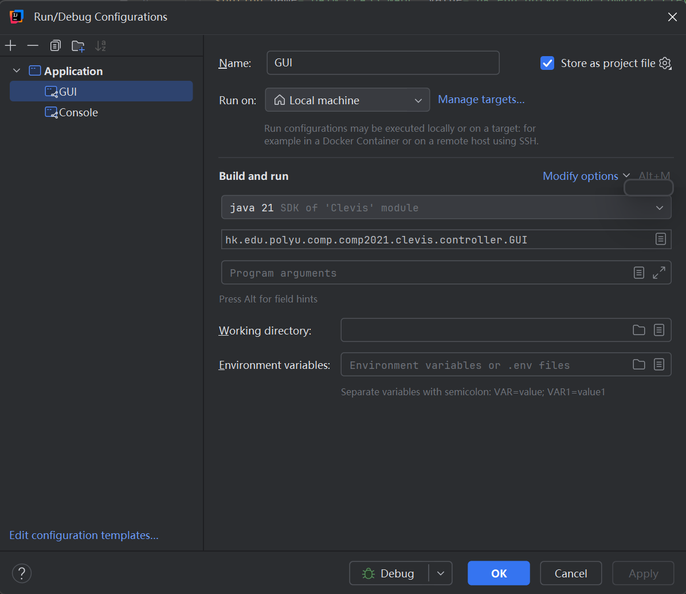
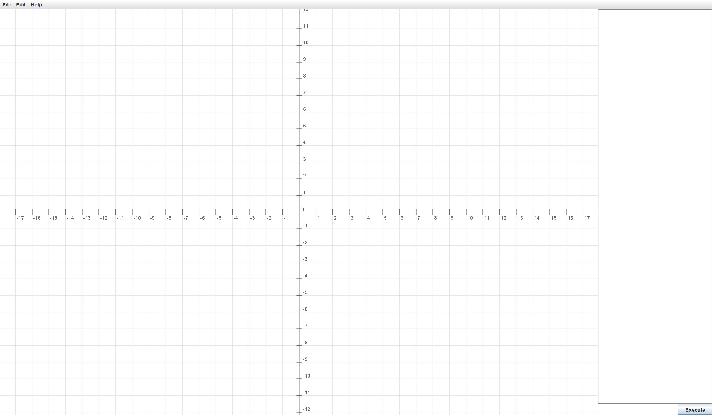
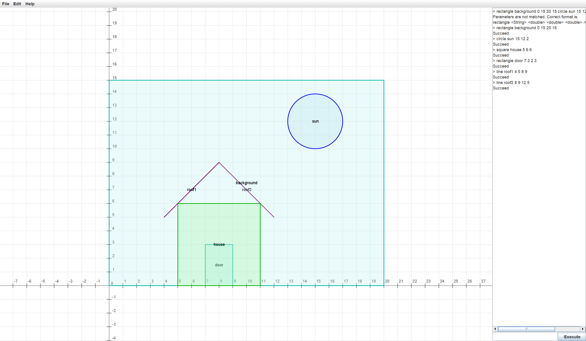
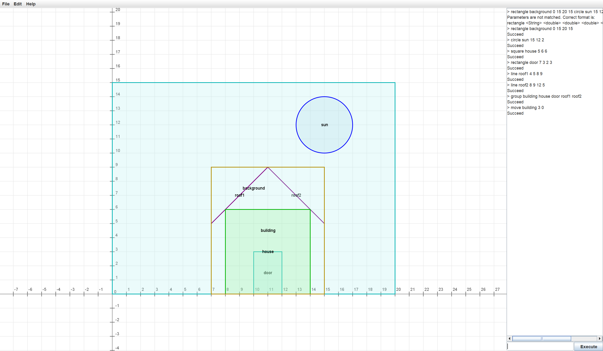
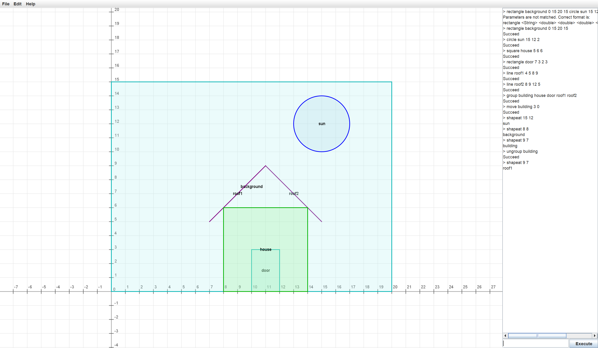
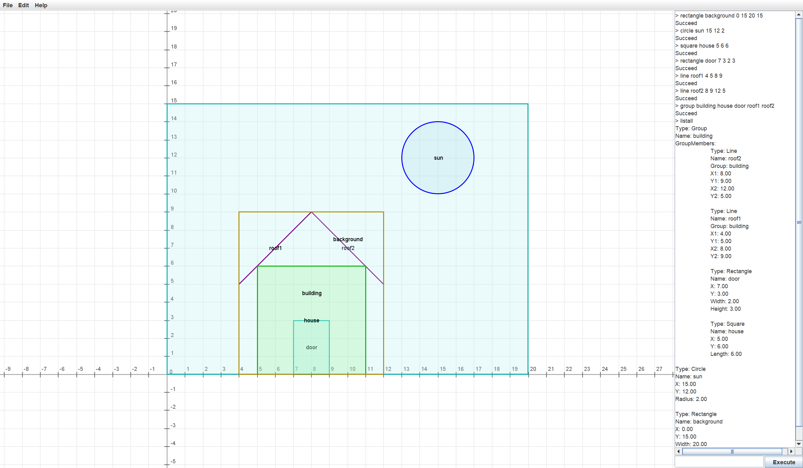

# Clevis Geometry System - User Manual

## 1. Introduction
Clevis is a comprehensive geometry management system that allows users to create, manipulate, and query various geometric shapes through both Command Line Interface (CLI) and Graphical User Interface (GUI). The system supports basic shapes, grouping operations, spatial queries, and provides robust logging capabilities for session management.

### System Overview
- **Dual Interface**: CLI for power users and GUI for visual interaction
- **Shape Management**: Create and manage rectangles, lines, circles, squares, and groups
- **Spatial Operations**: Move, delete, intersect detection, and bounding box calculations
- **Session Logging**: Automatic logging of all operations in HTML and TXT formats
- **Undo/Redo Support**: Full command history management (excluding queries)

## 2. Commands Description

### 2.1 Basic Shape Creation Commands

#### Rectangle
```bash
rectangle n x y w h
```
- **Functionality**: Creates a rectangle with specified dimensions
- **Parameters**:
  - `n`: Unique name for the shape
  - `x, y`: Top-left corner coordinates
  - `w, h`: Width and height
- **Usage Example**: `rectangle rect1 0 0 10 5`

#### Line
```bash
line n x1 y1 x2 y2
```
- **Functionality**: Creates a line segment between two points
- **Parameters**:
  - `n`: Unique name for the shape
  - `x1, y1, x2, y2`: Endpoint coordinates
- **Usage Example**: `line line1 0 0 5 5`

#### Circle
```bash
circle n x y r
```
- **Functionality**: Creates a circle with specified center and radius
- **Parameters**:
  - `n`: Unique name for the shape
  - `x, y`: Center coordinates
  - `r`: Radius
- **Usage Example**: `circle circle1 0 0 3`

#### Square
```bash
square n x y l
```
- **Functionality**: Creates a square with specified position and side length
- **Parameters**:
  - `n`: Unique name for the shape
  - `x, y`: Top-left corner coordinates
  - `l`: Side length
- **Usage Example**: `square square1 2 2 4`

### 2.2 Grouping Operations

#### Group
```bash
group n n1 n2 ...
```
- **Functionality**: Combines multiple shapes into a single group
- **Parameters**:
  - `n`: Name for the new group
  - `n1, n2, ...`: Names of shapes to group
- **Usage Example**: `group group1 rect1 circle1 square1`
- **Note**: Grouped shapes cannot be individually manipulated until ungrouped

#### Ungroup
```bash
ungroup n
```
- **Functionality**: Breaks a group into its component shapes
- **Parameters**:
  - `n`: Name of the group to ungroup
- **Usage Example**: `ungroup group1`

### 2.3 Shape Operations

#### Delete
```bash
delete n
```
- **Functionality**: Permanently removes a shape or group
- **Parameters**:
  - `n`: Name of shape to delete
- **Usage Example**: `delete rect1`
- **Note**: Deleting a group also deletes all member shapes

#### Move
```bash
move n dx dy
```
- **Functionality**: Translates a shape by specified offsets
- **Parameters**:
  - `n`: Name of shape to move
  - `dx, dy`: Horizontal and vertical displacement
- **Usage Example**: `move circle1 2 -1`

### 2.4 Query Commands

#### Bounding Box
```bash
boundingbox n
```
- **Functionality**: Calculates the minimum bounding rectangle
- **Output Format**: `x y w h` (top-left coordinates, width, height)
- **Usage Example**: `boundingbox group1`

#### Shape At Point
```bash
shapeAt x y
```
- **Functionality**: Finds the topmost shape covering a point
- **Coverage Definition**: Point-to-outline distance < 0.05
- **Z-order**: Later-created shapes have higher priority
- **Usage Example**: `shapeAt 3.5 2.1`

#### Intersect Check
```bash
intersect n1 n2
```
- **Functionality**: Checks if two shapes' bounding boxes intersect
- **Parameters**:
  - `n1, n2`: Names of shapes to check
- **Usage Example**: `intersect rect1 circle1`

#### List Shape Information
```bash
list n
```
- **Functionality**: Displays detailed information about a shape
- **Simple Shapes**: Shows construction parameters
- **Groups**: Shows group name and direct members
- **Usage Example**: `list group1`

#### List All Shapes
```bash
listAll
```
- **Functionality**: Displays all shapes in Z-order (newest first)
- **Format**: Indented hierarchy showing group relationships
- **Usage Example**: `listAll`

### 2.5 System Commands

#### Quit
```bash
quit
```
- **Functionality**: Terminates the Clevis session
- **Note**: All unsaved geometry data is lost

#### Undo/Redo
```bash
undo
redo
```
- **Functionality**: Manages command history
- **Limitation**: Query commands cannot be undone/redone

## 3. Step-by-Step Instructions

### 3.1 Starting the Application

#### Use IntelliJ

open the project in IntelliJ
Find **More Actinos** on the top right page, which is 3 dots lining up vertically.
Click **Edit** in **Configuration** 
Click on the **+** sign on the top right of the window oppened.
Configue it in the format of this picture.


```CLI Mode
# Main class
java hk.edu.polyu.comp.comp2021.clevis.Console
```

```GUI Mode
# Basic GUI startup
java hk.edu.polyu.comp.comp2021.clevis.GUI
```

```Program arguments
# Program arguments optional:
-html .\log.html -txt .\log.txt -eps 0.01 -hist 100
```

#### Use other tools

Configure it similar to IntelliJ.

### 3.2 Creating Your First Drawing

Start with basic shapes:
```text
rectangle background 0 15 20 15
circle sun 15 12 2
square house 5 6 6
```

Add details:
```text
rectangle door 7 3 2 3
line roof1 4 5 8 9
line roof2 8 9 12 5
```

Group related shapes:
```text
group building house door roof1 roof2
```

### 3.3 Modifying the Drawing

Move elements:
```text
move building 2 1
move sun -1 0
```

Check spatial relationships:
```text
intersect building sun
shapeAt 10 7
```

View information:
```text
list building
listAll
```

### 3.4 Using Advanced Features

Enable logging for session recording:
```Program arguments
-html session.html -txt session.txt
```

Use rerun mode for demonstrations:
```Program arguments
-txt previous_session.txt -rerun 1000
```

## 4. Screenshots

### 4.1 GUI Interface Overview

Main Clevis GUI showing drawing canvas (left), output panel (right), and command input (bottom)

### 4.2 Basic Shape Creation

Result of creating rectangle, circle, and square shapes with bounding boxes displayed

### 4.3 Grouping Operation

Multiple shapes grouped together and moved as a single unit

### 4.4 Spatial Query Results

ShapeAt query showing the topmost shape at cursor position (highlighted in red)

### 4.5 ListAll Output

Hierarchical display of all shapes with indentation showing group relationships

## 5. Troubleshooting

### 5.1 Common Error Messages and Solutions

#### Command does not exist
- **Cause**: Typo in command name or unsupported command
- **Solution**: Use help to see available commands, check spelling

#### Parameters are not matched
- **Cause**: Incorrect number or type of parameters
- **Solution**: Refer to command documentation for correct syntax
- **Example**: `rectangle name x y width height` requires 5 parameters

#### Key "..." already exists.
- **Cause**: Attempting to use duplicate shape names
- **Solution**: Use unique names for all shapes
- **Workaround**: Delete existing shape or use different name

#### "..." does not exist.
- **Cause**: Referencing non-existent shape
- **Solution**: Check spelling, use `listAll` to see available shapes

#### one member can not form a group.
- **Cause**: Attempting to group only one shape.
- **Solution**: Ensure group contains at least 2 shapes.

#### "..." unaccessible.
- **Cause**: Attempting to directly access a shape that is already grouped.
- **Solution**: Ensure the shape accessed is no contained in any group.

#### "..." is not a group.
- **Cause**: Attempting to ungroup a shape that is not a group.
- **Solution**: Ensure the shape to ungroup is a group.

#### There is no command to redo.
- **Cause**: Attempting to redo when there is no command to redo.
- **Solution**: Ensure to undo before redo.

#### There is no command to undo.
- **Cause**: Attempting to undo when there is no command to undo or the history reaches the max.
- **Solution**: Ensure there is command in the history.

### 5.2 Performance Issues

#### Slow rendering with many shapes
- **Solution**: Remove some unused shapes.

#### High memory usage
- **Solution**: Decrease the history size by using `-hist` parameter.

### 5.3 File Operation Problems

#### Cannot write log files
- **Cause**: Invalid file path or permission issues
- **Solution**:
  - Use absolute paths: `-html C:\Users\name\logs\session.html`
  - Check write permissions in target directory
  - Ensure directory exists before specifying path

#### Rerun mode not working
- **Cause**: Missing or invalid TXT file
- **Solution**:
  - Verify TXT file exists and contains valid commands
  - Ensure `-txt` parameter is provided with `-rerun`
  - Check command format in TXT file matches expected syntax

## 6. Additional Resources

### 6.1 Command Quick Reference

| Command       | Syntax                               | Description                    |
|---------------|--------------------------------------|--------------------------------|
| **Operations**|                                      |                                |
| rectangle     | `rectangle name x y w h`             | Create rectangle               |
| line          | `line name x1 y1 x2 y2`              | Create line segment            |
| circle        | `circle name x y r`                  | Create circle                  |
| square        | `square name x y l`                  | Create square                  |
| group         | `group name shape1 shape2...`        | Create group                   |
| ungroup       | `ungroup name`                       | Break apart group              |
| move          | `move name dx dy`                    | Move shape                     |
| delete        | `delete name`                        | Remove shape                   |
| **Queries**   |                                      |                                |
| boundingbox   | `boundingbox name`                   | Get bounding box               |
| shapeAt       | `shapeAt x y`                        | Find shape at point            |
| intersect     | `intersect name1 name2`              | Check intersection             |
| list          | `list name`                          | Show shape info                |
| listAll       | `listAll`                            | Show all shapes                |
| undo          | `undo`                               | Undo last operation            |
| redo          | `redo`                               | Redo undone operation          |
| quit          | `quit`                               | Exit application               |

### 6.2 Technical Specifications
- **Coordinate System**: Cartesian coordinates with origin at bottom-left
- **Precision**: Double-precision floating point, displayed with 2 decimal places
- **Z-order**: Later-created shapes appear on top
- **Intersection Detection**: Based on minimum bounding box overlap
- **Coverage Detection**: 0.05 unit distance threshold from shape outline

### 6.3 File Formats

#### HTML Log Format
```html
<table>
  <tr><th>Index</th><th>Command</th></tr>
  <tr><td>1</td><td>rectangle rect1 0.00 0.00 10.00 5.00</td></tr>
  <tr><td>2</td><td>circle circle1 5.00 5.00 3.00</td></tr>
</table>
```

#### TXT Log Format
```text
rectangle rect1 0.00 0.00 10.00 5.00
circle circle1 5.00 5.00 3.00
move rect1 2.00 1.00
```

### 6.4 Support Information
- **Academic Use**: Designed for COMP2021 Object-Oriented Programming course
- **Platform**: Java-based, cross-platform compatible
- **Dependencies**: Standard Java Runtime Environment (JRE 8+)
- **Source**: Polytechnic University Hong Kong, COMP Department

For additional assistance with the Clevis Geometry System, consult the course materials or contact the teaching team during designated office hours.
